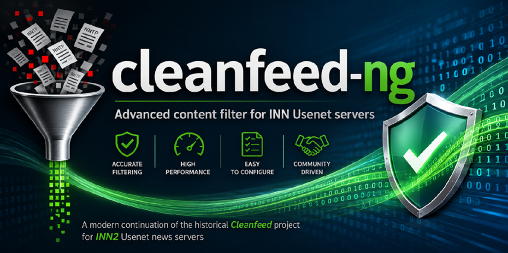

<p align="center">
  <a href="https://github.com/infybofh/cleanfeed-ng">
    
  </a>


[](LICENSE)


</p>

# cleanfeed-ng

`cleanfeed-ng` is a maintained, lightweight continuation of the historical Cleanfeed filter for the Perl filtering interface of INN `innd`. It is designed for server-to-server Usenet transit filtering, with particular attention to predictable behaviour, low overhead, safe configuration changes, and useful diagnostics.

> **Stable packaged release:** `2026.07.3-rc1` — available as a ZIP from [GitHub Releases](https://github.com/infybofh/cleanfeed-ng/releases).  
> **Development tree:** `2026.07.3-rc2` — testing only, available from the `main` branch and not published as a release ZIP.  
> **Runtime:** Perl 5.38 or newer; Ubuntu 24.04 LTS is the minimum supported platform baseline.

> [!WARNING]
> The `main` branch currently contains **2026.07.3-rc2**. It is under active testing and should be used at your own risk. Administrators who want the current stable, packaged baseline should use **2026.07.3-rc1** from the Releases page.

> [!IMPORTANT]
> cleanfeed-ng requires the Perl interpreter **embedded in `innd`** to be
> version 5.38 or newer. The one-time runtime banner reports the actual embedded
> version as `perl=v...`. Changing `/usr/bin/perl` or `update-alternatives` does
> not replace the interpreter already loaded by a running `innd`; restart INN
> completely after any Perl or libperl change.

## Project goals

- Preserve the practical philosophy and proven filtering model of Cleanfeed.
- Correct long-standing defects and modernize the implementation for current INN systems.
- Keep the synchronous `innd` hot path lightweight: no network calls, databases, HTTP services, antivirus engines, or other blocking dependencies.
- Make new heuristics observable before enforcement through `audit` mode.
- Emit granular, stable `CF-*` reason codes so administrators can identify the exact rule that matched.
- Provide exhaustive, heavily commented examples suitable for both experienced newsmasters and new administrators.

## Highlights

- Improved yEnc, MIME, Base64, uuencode, and misplaced-binary detection.
- Correct multipart yEnc metadata validation without comparing a complete-file size to a single article part.
- Peer- and hierarchy-based policies with `off`, `audit`, `quarantine`, and `reject` modes.
- Safe external regex loading with validation and last-known-good retention.
- Trusted-source lists with granular bypass controls.
- Bounded counters, CSV and key/value statistics, structured syslog events, and an HTML statistics page.
- Atomic state/statistics writes and configuration fingerprinting.
- Standalone configuration and article-inspection tooling.
- Comment-only `bad_*` and `trusted_*` examples that are safe to copy before customization.

## RC2 development focus

The `2026.07.3-rc2` development tree keeps the RC1 filtering behaviour while making two deliberately small hot-path changes:

- the obsolete Perl `study()` call has been removed; the old `study_max_lines` setting is temporarily accepted, ignored, and reported as deprecated;
- deterministic regex classification of frequently repeated newsgroup names uses a lightweight bounded cache, with no LRU bookkeeping, per-hit logging, article-decision caching, or moderation-state caching. Group names longer than 255 bytes are classified normally but are not retained.

External body rules continue to preserve historical Cleanfeed semantics: `bad_body`, `bad_url`, and `bad_url_central` inspect a bounded, cached, lowercased text window, and top-level `text/*` Base64 content is decoded before matching.

## Versioning

cleanfeed-ng versions use:

```text
YYYY.MM.VV[-alN|-beN|-rcN]
```

`YYYY` is the year, `MM` the month, and `VV` the sequential project version within that month. Optional suffixes identify alpha (`-alN`), beta (`-beN`), and release-candidate (`-rcN`) builds. The RC1 package was originally published under the older label `2026-07-03 RC1`; its canonical name under this scheme is `2026.07.3-rc1`.

## Start here

1. Read the complete installation and operational guide: [`README.txt`](README.txt).
2. Review every setting in the canonical configuration reference: [`cleanfeed.local.example`](cleanfeed.local.example).
3. Read the reason-code reference: [`docs/REASON-CODES.md`](docs/REASON-CODES.md).
4. For Perl regex examples, see [`docs/REGEX-COOKBOOK.md`](docs/REGEX-COOKBOOK.md) when present and [`samples/README.txt`](samples/README.txt).
5. Begin new or changed policies in `audit` mode and inspect real traffic before enabling `reject`.

## Configuring `CLEANFEED_CONFIG_DIR`

`cleanfeed-ng` reads `cleanfeed.local` and the external `bad_*` / `trusted_*`
files from the directory selected by the `CLEANFEED_CONFIG_DIR` environment
variable.

Its behaviour is:

```text
CLEANFEED_CONFIG_DIR=/some/path   use /some/path
CLEANFEED_CONFIG_DIR=''           disable all external configuration files
variable not set                  use /usr/local/news/cleanfeed/etc
```

The empty value is mainly useful for syntax checks and tests. For a real INN
installation, set an explicit directory in the environment of the **innd
service**. On Debian or Ubuntu installations using the `inn2` systemd service:

```sh
sudo systemctl edit inn2
```

Add:

```ini
[Service]
Environment="CLEANFEED_CONFIG_DIR=/etc/news/filter/cleanfeed-ng"
```

Then apply it with a full restart:

```sh
sudo systemctl daemon-reload
sudo systemctl restart inn2
```

Verify the environment inherited by the running `innd` process:

```sh
sudo sh -c 'tr "\\0" "\\n" < /proc/$(pidof innd)/environ | \
  grep "^CLEANFEED_CONFIG_DIR="'
```

> [!IMPORTANT]
> `ctlinnd reload filter.perl` reloads the Perl filter and its configuration,
> but it cannot change environment variables already inherited by the running
> `innd` process. After adding or changing `CLEANFEED_CONFIG_DIR` in systemd or
> another startup script, restart INN completely once. Later changes inside
> `cleanfeed.local` only require the normal filter reload.

On systems not using systemd, export the variable in the script or service
manager that starts `innd`. Editing the fallback `$config_dir` directly in
`cleanfeed` also works, but is discouraged because a later repository update
may overwrite that local modification.

## Perl version and failed-load diagnostics

cleanfeed-ng performs a bootstrap check before normal initialization. If the
Perl interpreter used by `innd` is older than 5.38, loading is aborted and an
explicit message is sent to the INN error log, for example:

```text
filter: cleanfeed-ng fatal: Perl 5.38.0 or newer is required; the running interpreter is v5.34.0; filter not loaded
```

Check `news.err`, the system journal, and the general system log after a failed
reload. A successful first article after load or reload produces a one-time
runtime line similar to:

```text
filter: cleanfeed-ng runtime version=2026.07.3-rc2 perl=v5.38.2 initialization=ok ...
```

The version printed by `perl -V` in an interactive shell may differ from the
libperl already embedded in a running `innd`. After changing Perl alternatives,
packages, or libperl, use a full INN restart rather than only
`ctlinnd reload filter.perl`.

## Quick verification

From the extracted package directory:

```sh
CLEANFEED_CONFIG_DIR='' perl -c cleanfeed
perl -c cleanfeed.local.example
perl -c cleanfeed-admin.pl
prove -v tests
sha256sum -c MANIFEST-SHA256.txt
```

The checksum manifest is intentionally deployment-focused. It covers the runtime filter, administrative/helper programs, canonical configuration, and operator-editable sample/list files. Repository metadata, GitHub templates, prose documentation, licensing text, central-list project scaffolding, and tests are deliberately not included in that manifest.

## Documentation

- [`README.txt`](README.txt) — installation, deployment, rollback, configuration, logging, statistics, and operational guidance.
- [`cleanfeed.local.example`](cleanfeed.local.example) — exhaustive parameter reference with extensive comments and examples.
- [`TECHNICAL-REVIEW.md`](TECHNICAL-REVIEW.md) — implementation review and design notes.
- [`CHANGELOG.md`](CHANGELOG.md) — release history.
- [`CONTRIBUTING.md`](CONTRIBUTING.md) — contribution and review expectations.
- [`SECURITY.md`](SECURITY.md) — security reporting and deployment assumptions.

## Safety and performance

The filter runs synchronously inside the INN article path. Expensive work is bounded where possible, shared scan windows are cached per article, disabled checks should avoid body inspection, and periodic reports are not generated for every article. Nevertheless, every site has different traffic. Use `audit` first, monitor CPU and log volume, and validate representative traffic before promoting a rule to `reject`.

No content detector can identify every deliberately encrypted or arbitrarily obfuscated payload without risking false positives. Content checks should be combined with narrow hierarchy/peer policy, conservative limits, and site-specific evidence.

## Project history and credit

Cleanfeed was originally developed by **Jeremy Nixon**, who maintained it until 1998. Further development was then taken on by **Marco d'Itri**, followed by later updates and maintenance by **Steve Crook**. Their original credit and copyright notices are retained in the source.

`cleanfeed-ng` continues that historical work. The goal is not to erase or replace it, but to keep a proven INN transit filter maintained, testable, understandable, and useful on current systems.

## Contributing

Bug reports, false-positive reports, performance measurements, documentation fixes, tests, and code contributions are welcome. Please include the exact version, relevant `CF-*` code, sanitized log lines, configuration context, and enough article structure to reproduce the issue without publishing private data.

See [`CONTRIBUTING.md`](CONTRIBUTING.md) before submitting changes.

## License

Distributed under the license included in [`LICENSE`](LICENSE), while retaining the notices and terms applicable to the original Cleanfeed code.
